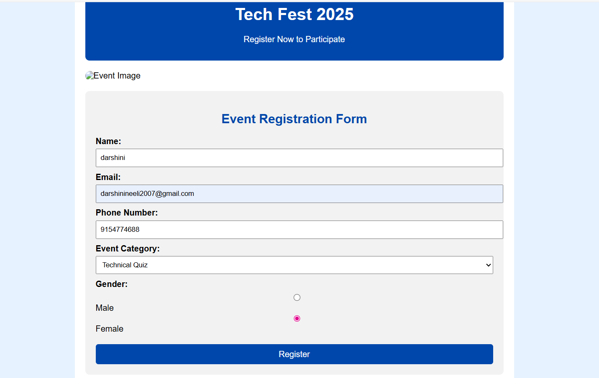

# Ex09 Event Registration Web Application
## Date:24.12.2025

## AIM:
To design, develop and deploy a web application for event registration.

## DESIGN STEPS:

### Step 1:
Create a new frame.

### Step 2:
Select any one preset size of your choice.

### Step 3:
Select the shapes you need.

### Step 4:
Import images as needed.

### Step 5:
Create pages based on your need and link them.

### Step 6:

Validate the HTML and CSS code.

### Step 6:

Publish the website in the given URL.

## DESIGN TOOL:
Figma

## CODE:
```
html
<!DOCTYPE html>
<html lang="en">
<head>
    <meta charset="UTF-8">
    <title>Event Registration</title>
    <link rel="stylesheet" href="style.css">
</head>
<body>

<div class="container">

    <header>
        <h1>Tech Fest 2025</h1>
        <p>Register Now to Participate</p>
    </header>

    

    <form class="registration-form">
        <h2>Event Registration Form</h2>

        <label>Name:</label>
        <input type="text" required>

        <label>Email:</label>
        <input type="email" required>

        <label>Phone Number:</label>
        <input type="tel" required>

        <label>Event Category:</label>
        <select required>
            <option>Select</option>
            <option>Workshop</option>
            <option>Technical Quiz</option>
            <option>Coding Contest</option>
            <option>Paper Presentation</option>
        </select>

        <label>Gender:</label>
        <div class="radio">
            <input type="radio" name="gender"> Male
            <input type="radio" name="gender"> Female
        </div>

        <button type="submit">Register</button>
    </form>

    <footer>
        <p>© 2025 Tech Fest | All Rights Reserved</p>
    </footer>

</div>

</body>
</html>
```
css
body {
    background-color: #e6f2ff;
    font-family: Arial, sans-serif;
}

.container {
    width: 800px;
    margin: auto;
    background-color: white;
    padding: 20px;
    border-radius: 10px;
}

header {
    text-align: center;
    background-color: #0047ab;
    color: white;
    padding: 15px;
    border-radius: 8px;
}

.event-img {
    width: 100%;
    height: 250px;
    margin: 20px 0;
    border-radius: 10px;
}

.registration-form {
    background-color: #f2f2f2;
    padding: 20px;
    border-radius: 8px;
}

.registration-form h2 {
    text-align: center;
    color: #0047ab;
}

label {
    display: block;
    margin-top: 10px;
    font-weight: bold;
}

input, select {
    width: 100%;
    padding: 8px;
    margin-top: 5px;
}

.radio {
    margin-top: 5px;
}

button {
    margin-top: 20px;
    width: 100%;
    padding: 10px;
    background-color: #0047ab;
    color: white;
    border: none;
    font-size: 16px;
    border-radius: 5px;
}

button:hover {
    background-color: #002f6c;
}

footer {
    text-align: center;
    margin-top: 20px;
    color: gray;
}


## OUTPUT:


## RESULT:
The program to design, develop and deploy a web application for event registration is completed successfully.
